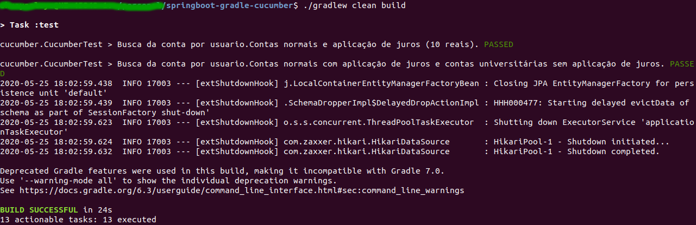

# springboot-gradle-cucumber

The goal of this project is to serve as a guide to configure an initial project using Spring Boot 2.3.0, Gradle 6 and Cucumber 5.7.0, all working successfully and finally generating Jacoco Reports. 

Only to prove the functionality of language, the cucumber feature file and code are configured to use portuguese.  

## Requirement

* JDK 11 (I use Amazon Corretto https://aws.amazon.com/corretto/)

## Build and Running tests

Only run to command below to use the gradle wrapper to build the project and run the cucumber tests
```
./gradlew clean build
```



## Jacoco report

Running the following gradle task:
```
./gradlew jacocoTestReport
```
many files will be generated inside the directory: `build/reports/jacoco/test/html/` 

Open the `index.html` and see it in your browser


